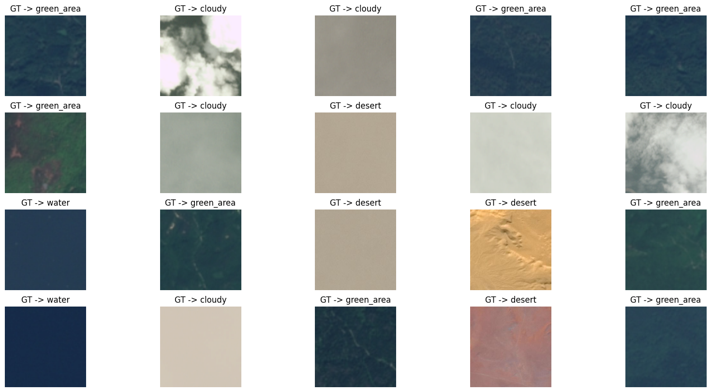
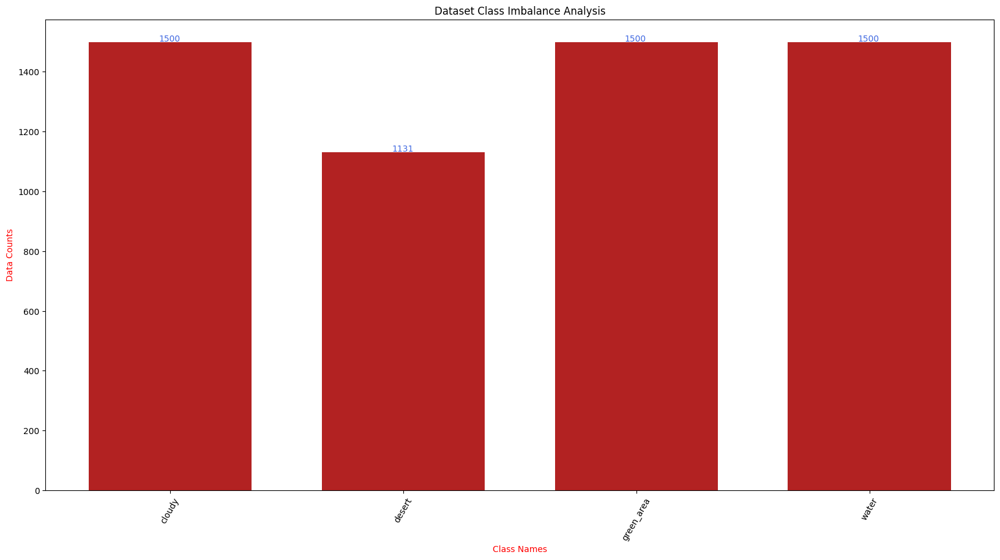

# 🛰️ Satellite Image Classification with PyTorch

A comprehensive deep learning pipeline for satellite image classification using PyTorch and transfer learning with GradCAM visualization.

## 📋 Table of Contents

- [Features](#features)
- [Project Structure](#project-structure)
- [Installation](#installation)
- [Dataset Structure](#dataset-structure)
- [Usage](#usage)
- [Results](#results)
- [Model Architecture](#model-architecture)
- [Visualization Examples](#visualization-examples)
- [Contributing](#contributing)
- [License](#license)

## ✨ Features

- **Custom Dataset Loader**: Efficient data loading with PyTorch DataLoader
- **Transfer Learning**: Uses pretrained models from `timm` library
- **Comprehensive Training**: Training with validation and early stopping
- **Multiple Metrics**: Tracks loss, accuracy, and F1-score
- **GradCAM Visualization**: Visual explanations of model predictions
- **Class Imbalance Analysis**: Detailed dataset statistics
- **Learning Curves**: Training and validation metrics visualization
- **Confusion Matrix**: Detailed performance analysis

## 📁 Project Structure

```
satellite-image-classification/
│
├── dataset.py              # Dataset and DataLoader utilities
├── train.py                # Training script and Trainer class
├── inference.py            # Inference and evaluation with GradCAM
├── visualization.py        # Visualization utilities
├── main.py                 # Main training pipeline
├── requirements.txt        # Project dependencies
├── README.md              # This file
│
│
└── outputs/               # Generated outputs (created automatically)
    ├── models/            # Saved model checkpoints
    ├── visualizations/    # Dataset and training visualizations
    └── results/           # Evaluation results and GradCAM
```

## 🚀 Installation

### Prerequisites

- Python 3.8+
- CUDA-capable GPU (recommended)

### Setup

1. Clone this repository:
```bash
git clone https://github.com/Matrasulov/Satellite-image-classification.git
cd Satellite-image-classification
```

2. Install dependencies:
```bash
pip install -r requirements.txt
```

## 📊 Dataset Structure

Organize your satellite images in the following structure:

```
data/
├── cloudy/
│   ├── image1.jpg
│   ├── image2.jpg
│   └── ...
├── desert/
│   ├── image1.jpg
│   └── ...
├── green_area/
│   └── ...
└── water/
    └── ...
```

Each subdirectory represents a different class, and images should be in common formats (`.jpg`, `.png`, etc.).

## 💻 Usage

### Basic Training

Run the complete training pipeline with default settings:

```bash
python main.py --data_dir ./data
```

### Advanced Training

Customize training with various parameters:

```bash
python main.py \
    --data_dir ./data \
    --output_dir ./outputs \
    --model_name rexnet_150 \
    --batch_size 32 \
    --epochs 10 \
    --lr 3e-4 \
    --image_size 224 \
    --patience 5 \
    --device cuda
```

### Command Line Arguments

| Argument | Default | Description |
|----------|---------|-------------|
| `--data_dir` | Required | Path to dataset directory |
| `--output_dir` | `outputs` | Directory to save outputs |
| `--model_name` | `rexnet_150` | Model architecture (from timm) |
| `--batch_size` | `32` | Batch size for training |
| `--epochs` | `10` | Number of training epochs |
| `--lr` | `3e-4` | Learning rate |
| `--image_size` | `224` | Input image size |
| `--num_workers` | `4` | Number of data loading workers |
| `--patience` | `5` | Early stopping patience |
| `--seed` | `2026` | Random seed for reproducibility |
| `--device` | `cuda` | Device to use (cuda/cpu) |

### Using Individual Modules

You can also use individual modules in your own scripts:

```python
from dataset import get_dataloaders
from train import create_model, Trainer
from visualization import plot_class_distribution
from inference import ModelEvaluator

# Load data
train_dl, val_dl, test_dl, classes = get_dataloaders(
    root='./data',
    transformations=transforms,
    batch_size=32
)

# Create model
model = create_model('rexnet_150', num_classes=len(classes))

# Train
trainer = Trainer(model, train_dl, val_dl, len(classes))
metrics = trainer.train()
```

## 📈 Results

The training pipeline generates comprehensive results:

### 1. Dataset Visualizations

- **Sample Images**: Random samples from train/val/test sets

- **Class Distribution**: Bar chart showing class imbalance


### 2. Training Metrics

- **Loss Curves**: Training and validation loss over epochs
- **Accuracy Curves**: Training and validation accuracy over epochs
- **F1 Score Curves**: Training and validation F1 scores over epochs

### 3. Evaluation Results

- **GradCAM Visualizations**: Visual explanations showing which regions the model focuses on
- **Confusion Matrix**: Detailed breakdown of predictions vs ground truth
- **Test Accuracy**: Final model performance on test set

## 🏗️ Model Architecture

This project supports various architectures from the `timm` library. Default: **ReXNet-150**

### Supported Models

You can use any model from `timm`, including:

- `rexnet_150` (default)
- `efficientnet_b0`, `efficientnet_b1`, etc.
- `resnet50`, `resnet101`
- `mobilenetv3_large_100`
- `vit_base_patch16_224`

Change the model using the `--model_name` argument.

## 🎨 Visualization Examples

### Dataset Samples

*Example training images from each class*

### Class Distribution

*Dataset class imbalance analysis*

### Training Curves

*Training and validation loss over epochs*


*Training and validation accuracy over epochs*


*Training and validation F1 scores over epochs*

### GradCAM Results

*GradCAM visualizations showing model attention*

### Confusion Matrix

*Detailed performance breakdown*

## 🔧 Customization

### Adding Custom Transformations

Modify the transformations in `main.py`:

```python
from torchvision import transforms as T

custom_transforms = T.Compose([
    T.Resize((224, 224)),
    T.RandomHorizontalFlip(p=0.5),
    T.RandomRotation(15),
    T.ColorJitter(brightness=0.2, contrast=0.2),
    T.ToTensor(),
    T.Normalize(mean=[0.485, 0.456, 0.406], 
                std=[0.229, 0.224, 0.225])
])
```

### Using Different Optimizers

Modify the optimizer in `train.py`:

```python
self.optimizer = torch.optim.AdamW(
    model.parameters(), 
    lr=learning_rate,
    weight_decay=1e-4
)
```

### Adjusting Class Weights

For imbalanced datasets, add class weights:

```python
class_weights = torch.tensor([1.0, 2.0, 1.5, 1.0]).to(device)
self.criterion = torch.nn.CrossEntropyLoss(weight=class_weights)
```

## 📝 Training Output

During training, you'll see output like:

```
============================================================
TRAINING
============================================================
Starting training...
============================================================
Epoch 1/10: 100%|████████████| 125/125 [00:45<00:00,  2.75it/s]

Epoch 1/10 - Training:
  Loss: 0.8234 | Acc: 0.6891 | F1: 0.6754
Epoch 1/10 - Validation:
  Loss: 0.5123 | Acc: 0.8234 | F1: 0.8156
  ✓ New best model saved!
------------------------------------------------------------
...
```

## 🤝 Contributing

Contributions are welcome! Please feel free to submit a Pull Request.

1. Fork the repository
2. Create your feature branch (`git checkout -b feature/AmazingFeature`)
3. Commit your changes (`git commit -m 'Add some AmazingFeature'`)
4. Push to the branch (`git push origin feature/AmazingFeature`)
5. Open a Pull Request

## 📄 License

This project is licensed under the MIT License - see the LICENSE file for details.

## 🙏 Acknowledgments

- [PyTorch](https://pytorch.org/) for the deep learning framework
- [timm](https://github.com/rwightman/pytorch-image-models) for pretrained models
- [torchmetrics](https://torchmetrics.readthedocs.io/) for metrics
- Original Jupyter notebook inspiration from Kaggle

## 📧 Contact

For questions or feedback, please open an issue on GitHub.

---

**Made with ❤️ for satellite image classification**
